# PhytoGenes - Plant Gene Knowledge Intelligent Retrieval Agent

 
> **Yang Lab**: [https://yanglab.hzau.edu.cn/](https://yanglab.hzau.edu.cn/)

---

## 1. Project Background & Goals

### 1.1 Background
With the rapid growth of plant genomics data, information is not only scattered across heterogeneous sources but also faces complex legacy issues due to long research spans. The evolution of gene naming standards and the continuous iteration of functional understanding have resulted in datasets full of synonyms, old designations, and obsolete descriptions. This heterogeneity and fragmentation make it difficult for researchers to efficiently identify and unify data when facing massive amounts of unstructured information.

### 1.2 Goals
To build a vertical AI agent based on the **Pydantic-AI** framework and **FastMCP** protocol. The agent aims to achieve:

* **Automated Multi-Source Retrieval**:
    * **Standard API Integration**: Direct connections for open databases (NCBI, Uniprot) via dedicated MCP modules.
    * **Lightweight Static Scraping**: HTML parsing for unprotected webpages.
    * **High-Resistance Simulation Crawling**: Integrated fingerprint browsers, ISP proxies, and Selenium to mimic human behavior for commercial data sources with strict anti-scraping mechanisms (e.g., TAIR).
    * **Deep Academic Retrieval**: Integration of SerpApi to bypass Google Scholar restrictions, automating literature list acquisition and metadata extraction.
* **Intelligent Routing**: Dynamic selection of retrieval strategies based on user input (Species-specific vs. Broad search).
* **Structured Archiving**: Utilizing LLMs to clean dispersed unstructured information and map it to a standard relational database schema.

---

## 2. Technical Architecture

### 2.1 Core Tech Stack

* **Agent Framework**: **Pydantic-AI**
    * *Selection Logic*: After evaluating CrewAI, Mastra, Agno (too abstracted/black-box), and AutoGen/SmolAgents (too autonomous/hard to control), we chose **Pydantic-AI**. It provides a "transparent" architecture that relies on explicit routing logic rather than implicit automation magic. This significantly reduces debugging difficulty and ensures deterministic outputs suitable for rigorous scientific data.
* **Tool Protocol**: **FastMCP**
    * Used to decouple tool services from Agent logic, allowing for modular development of fetchers and scrapers.
* **LLM Base**: **GPT-5.1 / Claude 4.5 Opus / Gemini 3 Pro** (Targeting late 2025 SOTA models).
* **Data Storage**: **MySQL** (Relational Database).
    * *Key Tables*: `genes`, `gene_aliases`, `map_locations`, `gene_features`, `proteins`, `go_annotations`, `polymorphisms`, `germplasms`, `publications`.

### 2.2 System Modules

```mermaid
---
config:
  layout: elk
---
flowchart TB
 subgraph M1[" "]
    direction TB
        Input["Receive User Natural Language Input"]
        CheckGene{"LLM Validation:<br>Contains Valid Gene Name?"}
        ErrorInput["Return Error Hint:<br>Invalid Input"]
        Extract["Entity Extraction:<br>Gene Name + Species Name"]
  end
 subgraph M2[" "]
    direction TB
        CheckSpecies{"Is Species Name<br>Extracted?"}
        MatchTool["LLM Match FastMCP Tool<br>e.g., Arabidopsis_TAIR_MCP"]
        CallSpecific["Call Specific DB API<br>+ Scholar_MCP with Species Keywords"]
        CallAll["Parallel Call to All<br>Registered DB MCPs"]
        CheckDBResult{"Database Results<br>Found?"}
        ScholarFull["Google Scholar<br>Full-Text Search"]
        CheckCount{"Result Count > 100?"}
        CircuitBreaker["Circuit Breaker:<br>Too many results &amp; no match<br>Stop &amp; Return Error"]
        ScholarVerify["Google Scholar Secondary Verification<br>Keywords: Result Species + User Gene Name"]
  end
 subgraph M3[" "]
    direction TB
        Aggregation["Data Aggregation:<br>JSON / HTML / Text"]
        Schema[("Target DB Schema")]
        LLMClean["LLM Cleaning &amp; Mapping<br>Based on Pydantic-AI Structured Output"]
        Classify{"Data Classification<br>Mapping"}
        TabExp["Table_Expression"]
        TabFunc["Table_Function"]
        TabSeq["Table_Sequence"]
        Persist["Generate SQL Object<br>Persist to Database"]
  end
    Start(("Start")) --> Input
    Input --> CheckGene
    CheckGene -- No --> ErrorInput
    ErrorInput --> End((("End Process")))
    CheckGene -- Yes --> Extract
    Extract --> CheckSpecies
    CheckSpecies -- Yes --> MatchTool
    MatchTool --> CallSpecific
    CallSpecific --> Aggregation
    CheckSpecies -- No --> CallAll
    CallAll --> CheckDBResult
    CheckDBResult -- Yes --> ScholarVerify
    ScholarVerify --> Aggregation
    CheckDBResult -- No --> ScholarFull
    ScholarFull --> CheckCount
    CheckCount -- Yes --> CircuitBreaker
    CircuitBreaker --> End
    CheckCount -- No --> Aggregation
    Aggregation --> LLMClean
    Schema --> LLMClean
    LLMClean --> Classify
    Classify --> TabExp & TabFunc & TabSeq
    TabExp --> Persist
    TabFunc --> Persist
    TabSeq --> Persist
    Persist --> End

     Input:::process
     CheckGene:::decision
     ErrorInput:::error
     Extract:::process
     CheckSpecies:::decision
     MatchTool:::process
     CallSpecific:::process
     CallAll:::process
     CheckDBResult:::decision
     ScholarFull:::process
     CheckCount:::decision
     CircuitBreaker:::error
     ScholarVerify:::process
     Aggregation:::process
     Schema:::db
     LLMClean:::process
     Classify:::decision
     TabExp:::process
     TabFunc:::process
     TabSeq:::process
     Persist:::process
     Start:::terminator
     End:::terminator
    classDef process fill:#e1f5fe,stroke:#01579b,stroke-width:2px
    classDef decision fill:#fff9c4,stroke:#fbc02d,stroke-width:2px
    classDef terminator fill:#eeeeee,stroke:#616161,stroke-width:2px
    classDef error fill:#ffcdd2,stroke:#c62828,stroke-width:2px,stroke-dasharray: 5 5
    classDef db fill:#e0e0e0,stroke:#333,stroke-width:2px,shape:cylinder
    style M1 fill:#fffde7,stroke:#fbc02d,stroke-width:1px
    style M2 fill:#fffde7,stroke:#fbc02d,stroke-width:1px
    style M3 fill:#e8eaf6,stroke:#3f51b5,stroke-width:1px
```

### 2.3 Setup & Requirements
* OS: Linux recommended.

* Language: Python 3.10+.

* Database: MySQL 8.0+.

* API Keys Required:
    * LLM Provider (OpenAI / Anthropic / Google)
    * SerpApi (for Google Scholar)
    * ISP Proxy Service (for crawling)
